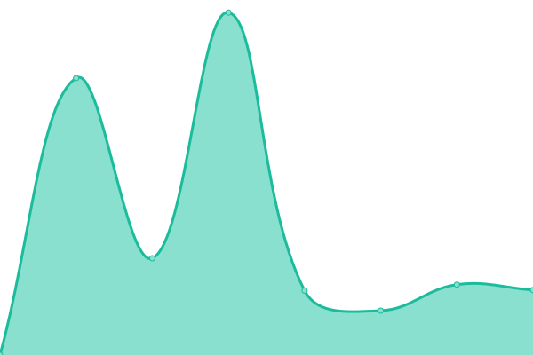
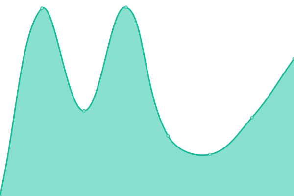

# [📈 Live Status](https://demo.upptime.js.org): <!--live status--> **🟩 All systems operational**

This repository contains the open-source uptime monitor and status page for [Yank Carlos](https://yank-cv.vercel.app/), powered by [Upptime](https://github.com/upptime/upptime).

With [Upptime](https://upptime.js.org), you can get your own unlimited and free uptime monitor and status page, powered entirely by a GitHub repository. We use [Issues](https://github.com/nubo94/upptime/issues) as incident reports, [Actions](https://github.com/nubo94/upptime/actions) as uptime monitors, and [Pages](https://demo.upptime.js.org) for the status page.

<!--start: status pages-->
<!-- This summary is generated by Upptime (https://github.com/upptime/upptime) -->
<!-- Do not edit this manually, your changes will be overwritten -->
<!-- prettier-ignore -->
| URL | Status | History | Response Time | Uptime |
| --- | ------ | ------- | ------------- | ------ |
|  [VITRi (Marketing)](https://vitri.store) | 🟩 Up | [vit-ri-marketing.yml](https://github.com/nubo94/upptime/commits/HEAD/history/vit-ri-marketing.yml) | 

 2685ms
     
 | 

<a href="https://nubo94.github.io/upptime/history/vit-ri-marketing">100.00%</a>
    

|  [VITRi (App)](https://app.vitri.store) | 🟩 Up | [vit-ri-app.yml](https://github.com/nubo94/upptime/commits/HEAD/history/vit-ri-app.yml) | 

 2436ms
     
 | 

<a href="https://nubo94.github.io/upptime/history/vit-ri-app">100.00%</a>
    

|  [VITRi (Policies)](https://policies.vitri.store) | 🟩 Up | [vit-ri-policies.yml](https://github.com/nubo94/upptime/commits/HEAD/history/vit-ri-policies.yml) | 

 1818ms
     
 | 

<a href="https://nubo94.github.io/upptime/history/vit-ri-policies">100.00%</a>
    

|  [VITRi (Blog)](https://blog.vitri.store) | 🟩 Up | [vit-ri-blog.yml](https://github.com/nubo94/upptime/commits/HEAD/history/vit-ri-blog.yml) | 

 2357ms
     
 | 

<a href="https://nubo94.github.io/upptime/history/vit-ri-blog">100.00%</a>
    

|  [VITRi (Roadmap)](https://roadmap.vitri.store) | 🟩 Up | [vit-ri-roadmap.yml](https://github.com/nubo94/upptime/commits/HEAD/history/vit-ri-roadmap.yml) | 

 3969ms
     
 | 

<a href="https://nubo94.github.io/upptime/history/vit-ri-roadmap">100.00%</a>
    

|  [Raffles (Dev)](https://develop-raffles-sigma.vercel.app) | 🟩 Up | [raffles-dev.yml](https://github.com/nubo94/upptime/commits/HEAD/history/raffles-dev.yml) | 

 3624ms
     
 | 

<a href="https://nubo94.github.io/upptime/history/raffles-dev">100.00%</a>
    

|  [Ai-Documents](https://ai-document-main.vercel.app) | 🟩 Up | [ai-documents.yml](https://github.com/nubo94/upptime/commits/HEAD/history/ai-documents.yml) | 

 2507ms
     
 | 

<a href="https://nubo94.github.io/upptime/history/ai-documents">100.00%</a>
    

|  [Yank Carlos CV](https://yank-cv.vercel.app/) | 🟩 Up | [yank-carlos-cv.yml](https://github.com/nubo94/upptime/commits/HEAD/history/yank-carlos-cv.yml) | 

 126ms
     
 | 

<a href="https://nubo94.github.io/upptime/history/yank-carlos-cv">100.00%</a>
    

<!--end: status pages-->

[**Visit our status website →**](https://demo.upptime.js.org)

## 📄 License

- Powered by: [Upptime](https://github.com/upptime/upptime)
- Code: [MIT](./LICENSE) © [Anand Chowdhary](https://anandchowdhary.com), supported by [Pabio](https://pabio.com)
- Data in the `./history` directory: [Open Database License](https://opendatacommons.org/licenses/odbl/1-0/)
